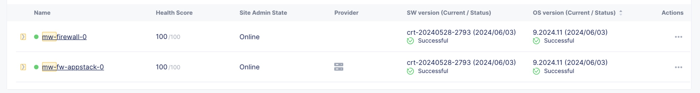
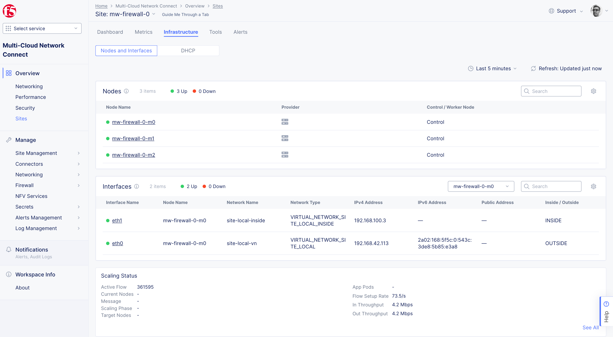
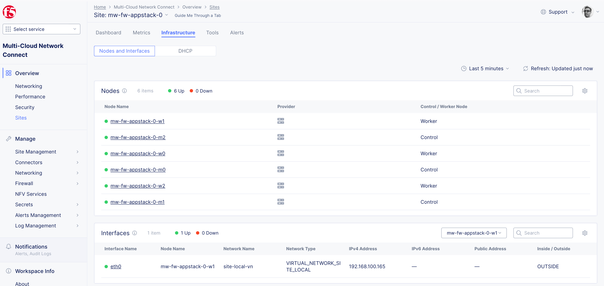
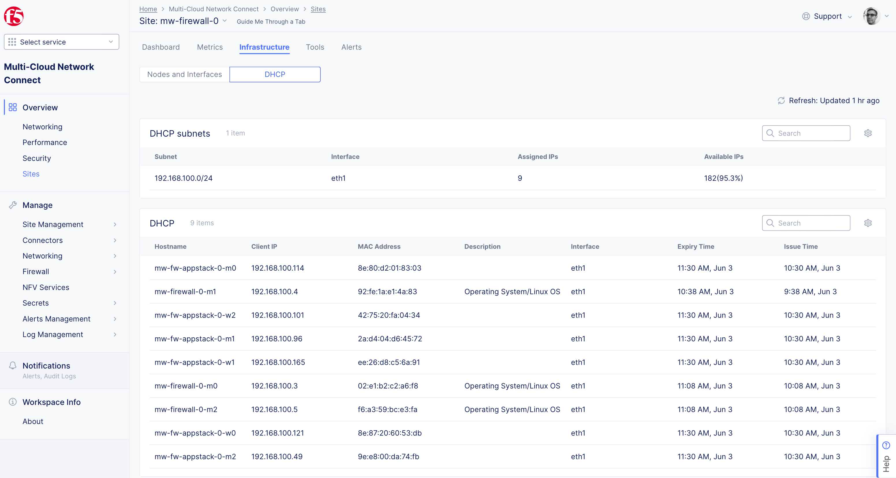

# Lab Appstack behind Secure Mesh

This lab setup builds a dual nic secure mesh site offering DHCP and SNAT services
to a multi-node Appstack site connected via the inside network of the secure mesh
site. Think of it like a fully redundant firewall, protecting the appstack cluster.


## Logical Topology

```
          ---+------+------+--- vmbr0 (Internet Access via SNAT)
             |      |      |              
           +----+ +----+ +----+
           | m0 | | m1 | | m2 | Secure Mesh Site
           +----+ +----+ +----+
             |      |      |              
 --+------+--+---+--+--+---+--+------+--  vmbr0 vlan 100
   |      |      |     |      |      |
+----+ +----+ +----+ +----+ +----+ +----+ 
| m0 | | m1 | | m2 | | w0 | | w1 | | w2 | Appstack Cluster
+----+ +----+ +----+ +----+ +----+ +----+ 

```

## Physical Topology

```
          Internet
             |      2.5G Ethernet Switch
   ---+------+--------+---------------+---
      |               |               |
+-----------+   +-----------+   +-----------+
|   prox1   |   |   prox2   |   |   prox3   |
| Intel NUC |   | Intel NUC |   | Intel NUC |
| i3-1315U  |   | i3-1315U  |   | i3-1315U  |
| 8C / 64GB |   | 8C / 64GB |   | 8C / 64GB |
|   Ceph    |   |   Ceph    |   |   Ceph    | 
+-----------+   +-----------+   +-----------+

```


The lab is deployed on a very small Proxmox cluster consisting of 3 ASUS/Intel NUC i3 with
64GB of RAM and 2 SSD's each using Ceph to share block (Cephpool) storage for Virtual Machines and Filesystem (cephfs) 
for ISO storage. This allows deployment of Virtual Machines across all Proxmox nodes with support for live migration.


A 2.5GE Ethernet switch connects the 3 NUCs together with an uplink port connected to a Internet Gateway. The whole setup
uses less than 120W AC Power with all 9 F5 XC VMs deployed for the Secure Mesh Site and App Stack Cluster.

Granted, for a production setup, separate high speed network is highly recommended for storage and data plane separation, but
for a small lab setup, this will do just fine.


## Deployment

To deploy, edit the file [../lab-firewall.tf](../lab-firewall.tf):

- set `count=1` in module "firewall"
- set `count=0` in all aother *.tf toplevel files to avoid building other sites at the same time
- set `inside_network` and `inside_network_vlan` to an avilable network on your Proxmox cluster in module "firewall"
- set `outside_network` and `outside_network_vlan` in module "fw-appstack" to match the inside_network of "firewall"

The provided example uses just a single vmbr0, but with vlan=100 for the network between secure mesh site (firewall) and
the appstack cluster.

Deploy with

```
terraform init
terraform plan
terraform apply
```

Once deployed, you can check status via F5 XC UI, including the DHCP leases assigned to the App Stack nodes. 



Firewall Nodes:


App Stack Nodes:


DHCP leases for the App Stack Nodes on Firewall Secure Mesh site:


Proxmox Cluster UI View:


Query App Stack nodes via kubectl, using the automatically generated `<prefix>-fw-appstack-0.kubeconfig`:

```
$ source env.sh
$ k get nodes -o wide
NAME                  STATUS   ROLES        AGE     VERSION       INTERNAL-IP       EXTERNAL-IP   OS-IMAGE                                      KERNEL-VERSION                 CONTAINER-RUNTIMEmw-fw-appstack-0-m0   Ready    ves-master   45m     v1.29.2-ves   192.168.100.114   <none>        Red Hat Enterprise Linux 9.2024.11.4 (Plow)   5.14.0-427.16.1.el9_4.x86_64   cri-o://1.26.5-5.ves1.el9
mw-fw-appstack-0-m1   Ready    ves-master   45m     v1.29.2-ves   192.168.100.96    <none>        Red Hat Enterprise Linux 9.2024.11.4 (Plow)   5.14.0-427.16.1.el9_4.x86_64   cri-o://1.26.5-5.ves1.el9mw-fw-appstack-0-m2   Ready    ves-master   45m     v1.29.2-ves   192.168.100.49    <none>        Red Hat Enterprise Linux 9.2024.11.4 (Plow)   5.14.0-427.16.1.el9_4.x86_64   cri-o://1.26.5-5.ves1.el9mw-fw-appstack-0-w0   Ready    <none>       5m54s   v1.29.2-ves   192.168.100.121   <none>        Red Hat Enterprise Linux 9.2024.11.4 (Plow)   5.14.0-427.16.1.el9_4.x86_64   cri-o://1.26.5-5.ves1.el9mw-fw-appstack-0-w1   Ready    <none>       5m51s   v1.29.2-ves   192.168.100.165   <none>        Red Hat Enterprise Linux 9.2024.11.4 (Plow)   5.14.0-427.16.1.el9_4.x86_64   cri-o://1.26.5-5.ves1.el9mw-fw-appstack-0-w2   Ready    <none>       6m12s   v1.29.2-ves   192.168.100.101   <none>        Red Hat Enterprise Linux 9.2024.11.4 (Plow)   5.14.0-427.16.1.el9_4.x86_64   cri-o://1.26.5-5.ves1.el9(base) m1:f5xc-proxmox-
```
